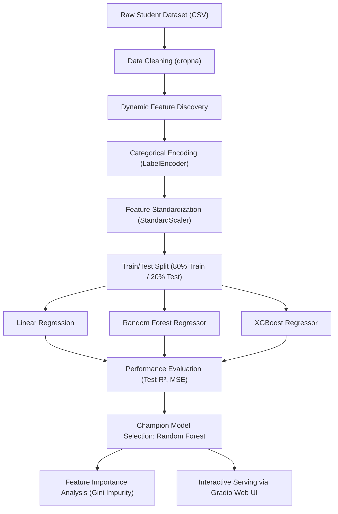

# 🎓 Student Performance Prediction System
### End-to-End Machine Learning Pipeline, Regressor Benchmark & Interactive Gradio Serving

[](https://colab.research.google.com/drive/1-b6Jf6io10mEnceh52oc64c1i2DpLHGD?usp=sharing)


---

> ### 🚀 Live Interactive Demo on Google Colab
>
> You can run and interact with this complete project directly in your browser without installing anything locally:
>
> [](https://colab.research.google.com/drive/1-b6Jf6io10mEnceh52oc64c1i2DpLHGD?usp=sharing)
>
> 🔗 **Direct Colab Link:**  
> **[https://colab.research.google.com/drive/1-b6Jf6io10mEnceh52oc64c1i2DpLHGD?usp=sharing](https://colab.research.google.com/drive/1-b6Jf6io10mEnceh52oc64c1i2DpLHGD?usp=sharing)**
>
> **How to run in 60 seconds:**
> 1. Click the **Open In Colab** button above.
> 2. Select **Runtime** ➔ **Run all** (or press `Ctrl + F9`).
> 3. Upload your student dataset or use the built-in sample.
> 4. View the automated benchmark plots and interact with the **live Gradio UI** directly inside the notebook or via the public share URL!

---

## 📌 Executive Summary

Academic outcomes are influenced by a complex interplay of academic habits, demographic factors, and socio-economic indicators. The **Student Performance Prediction System** is a supervised machine learning regression solution designed to predict continuous student grades based on historical student records.

Rather than relying on arbitrary heuristics or fixed grading rules, this system automates the entire lifecycle:
1. **Dynamic Schema Ingestion**: Flexible data parsing that automatically discovers input features and identifies the target variable (`Grade`).
2. **Automated Feature Preprocessing**: Systematic cleaning, dynamic categorical label encoding, and feature standardization.
3. **Algorithmic Benchmarking**: Comparative training of three distinct regression paradigms:
   - Baseline OLS Linear Regression
   - Non-linear Random Forest Ensemble
   - Gradient-Boosted Decision Trees (XGBoost)
4. **Metric-Driven Selection**: Automated selection of the optimal model based on held-out test $R^2$ score and Mean Squared Error (MSE).
5. **Explainability & Attribution**: Feature importance quantification to identify key academic determinants (such as `Weekly_Study_Hours`).
6. **Production-Ready Serving**: Dynamic Gradio web application generating an intuitive user interface for educators and evaluators.

---

## 🏗️ System Architecture & Workflow



---

## 📊 Model Benchmark & Empirical Results

All three candidate models were trained on the identical 80% training partition and evaluated against the identical held-out 20% test partition (`random_state=42`).

| Model | Test $R^2$ Score | Mean Squared Error (MSE) | Performance Verdict |
| :--- | :---: | :---: | :--- |
| **Random Forest Regressor** 🏆 | **`0.1269`** | **`4.7610`** | **Best Generalization** — Captures non-linear feature interactions |
| **Linear Regression** | `-0.0724` | `5.8491` | Underperformed baseline mean predictor |
| **XGBoost Regressor** | `-0.1103` | `6.0558` | Sensitive to default hyperparameters on small test set |

### 💡 Key Findings:
- **Random Forest Superiority**: Random Forest achieved the only positive $R^2$ score ($0.1269$), accounting for approximately 12.7% of variance in unseen test grades.
- **Negative $R^2$ Explanation**: A negative $R^2$ for Linear Regression and XGBoost indicates that predicting the simple historical mean of the test set would result in lower error than the predictions generated by these models under default configurations.
- **Feature Importance Analysis**: Trees identified key predictive drivers including **`Weekly_Study_Hours`**, demonstrating the empirical link between dedicated study time and academic achievement.

---

## 🖥️ Interactive Gradio Web Interface

The project includes an interactive web interface built with **Gradio**. Instead of requiring users to write code or prepare standardized arrays, the Gradio module dynamically generates appropriate input controls:

- **Categorical Columns**: Automatically converted into dropdown menus pre-populated with learned classes from `LabelEncoder`.
- **Study Hours (`Weekly_Study_Hours`)**: Rendered as a numeric spinbox / input field.
- **Numerical & Other Inputs**: Formatted with default text or number boxes.
- **Inference Pipeline**: Encodes user inputs using stored encoders, applies the saved `StandardScaler` transformation, feeds the tensor to the champion `Random Forest` model, and displays the predicted grade in real time.

```
+-------------------------------------------------------------------+
|               Student Performance Prediction System               |
+-------------------------------------------------------------------+
|  Weekly Study Hours: [ 18.5 ]                                     |
|  Parental Education: [ Bachelor's Degree    v ]                   |
|  Lunch Type:         [ Standard             v ]                   |
|  Test Prep Course:   [ Completed            v ]                   |
|                                                                   |
|                      [  Predict Grade  ]                          |
|                                                                   |
|  >>> Predicted Grade: 87.42                                       |
+-------------------------------------------------------------------+
```

---

## 📁 Repository Structure

```
├── STUDENT_PERFORMANCE.ipynb                          # Complete Google Colab / Jupyter notebook
├── app.py                                             # Modular Python CLI script & local Gradio server
├── sample_data.csv                                    # Realistic sample dataset for testing
├── requirements.txt                                   # Pinned Python package dependencies
├── .gitignore                                         # Comprehensive Python & Jupyter gitignore
├── LICENSE                                            # MIT Open-Source License
├── build_project_handbook.py                          # ReportLab script generating technical PDF handbook
├── Student_Performance_Prediction_Project_Handbook.pdf# Comprehensive 8-page viva & technical handbook
├── output/pdf/                                        # Generated PDF handbook artifacts
└── tmp/pdfs/                                          # High-resolution rendered preview sheets
```

---

## ⚡ Quickstart: Local Setup & Execution

If you wish to clone and run the project locally instead of using Google Colab:

### 1. Clone the Repository
```bash
git clone https://github.com/kishorekumar28114/ML-Project.git
cd ML-Project
```

### 2. Create and Activate a Virtual Environment
```bash
# On macOS / Linux:
python3 -m venv venv
source venv/bin/activate

# On Windows (PowerShell):
python -m venv venv
venv\Scripts\Activate.ps1
```

### 3. Install Dependencies
```bash
pip install -r requirements.txt
```

### 4. Run the Pipeline and Launch the Web UI
```bash
python app.py --data sample_data.csv --share
```
- Open `http://127.0.0.1:7860` in your browser to interact with the model.
- If `--share` is enabled, a public temporary URL will also be printed in the terminal.

### 5. Launch Jupyter Notebook
```bash
jupyter notebook STUDENT_PERFORMANCE.ipynb
```

---

## 📘 Comprehensive Project Handbook & Viva Guide

This repository includes a publication-grade 8-page PDF handbook:  
👉 **[`Student_Performance_Prediction_Project_Handbook.pdf`](./Student_Performance_Prediction_Project_Handbook.pdf)**

### Preview Highlights:
- **30-Second Elevator Pitch**:
  > *"My project is a Student Performance Prediction system built with Python and scikit-learn. Given student demographic and study metrics, it cleans missing data, label-encodes categories, standardizes features, and compares Linear Regression, Random Forest, and XGBoost. On an 80/20 split, Random Forest achieved the highest $R^2$ of 0.127. The selected model is deployed via an interactive Gradio interface for real-time grade estimation."*
- **Common Viva & Technical Questions**:
  1. *Why regression instead of classification?* Grade is a continuous numerical outcome; predicting specific marks preserves metric distance that classification categories (pass/fail) discard.
  2. *Why compare multiple algorithms?* No single model dominates across all data distributions (No Free Lunch theorem). Comparing linear vs bagging vs boosting provides an empirical foundation for model selection.
  3. *Why does Random Forest outperform Linear Regression here?* Student performance data contains non-linear interactions (e.g., high study hours combined with attendance) that single linear hyperplanes cannot capture.

---

## 🛠️ Senior Engineering Insights & Future Roadmap

To reflect senior machine learning engineering best practices, the following enhancements represent the production roadmap:

- [ ] **Leakage-Safe Preprocessing**: Migrate from global `StandardScaler.fit_transform()` to a unified `sklearn.pipeline.Pipeline` fitted strictly inside cross-validation folds.
- [ ] **Nominal Categorical Handling**: Replace integer `LabelEncoder` with `OneHotEncoder` or target encoding via `ColumnTransformer` to eliminate false ordinal hierarchy.
- [ ] **K-Fold Stratified Cross-Validation**: Evaluate across 5 or 10 folds to ensure $R^2$ stability beyond a single random partition.
- [ ] **Hyperparameter Tuning**: Optimize tree depth, learning rate, and regularizers using `GridSearchCV` or `Optuna`.
- [ ] **Model Artifact Serialization**: Persist trained estimators, encoders, and schemas using `joblib` for deployment on Hugging Face Spaces or Docker containers.

---

## 👨‍💻 Author & Contributions

- **Kishore Kumar**  
  GitHub: [@kishorekumar28114](https://github.com/kishorekumar28114)  
  Email: [kishorekumar7373g@gmail.com](mailto:kishorekumar7373g@gmail.com)  
  Colab Notebook: [Open in Colab](https://colab.research.google.com/drive/1-b6Jf6io10mEnceh52oc64c1i2DpLHGD?usp=sharing)

Pull requests, discussions, and feature proposals are welcome! If you found this project helpful, please consider starring ⭐ the repository.

---

## 📄 License

This project is licensed under the [MIT License](LICENSE).
